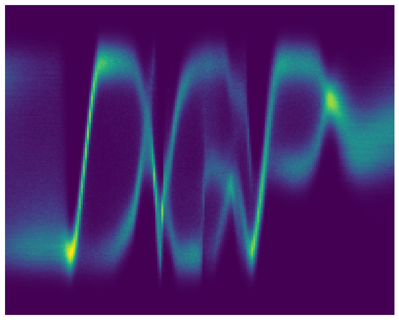

> :warning: **This is old, untested and undocumented code. It's only use-case is to reproduce the experiment below using the original code**. The original experiment and the code in `experiment.py` was written by Hugh Salimbeni for the paper [Deep Gaussian Processes with Importance-Weighted Variational Inference](https://arxiv.org/pdf/1905.05435.pdf). The code under `src` is an early version of [GPflux](https://github.com/secondmind-labs/GPflux).


# Toy Deep Gaussian Process experiment

Code to reproduce experiment Fig 1. from [Salimbeni et al. (2018)](https://arxiv.org/pdf/1905.05435.pdf) and Fig. 7 [Leibfried et al. 2021](https://arxiv.org/abs/2012.13962).

<table>
  <tr>
  <td> GP </td>
  <td> GP + GP </td>
  <td> Latent Layer (LL) + GP </td>
  <td> LL + GP + GP </td>
  </tr>
  <tr>
    <td> </td>
    <td> </td>
    <td> </td>
    <td> </td>
   </tr> 
  </tr>
</table>

## Installation

Disclaimer: legacy code written in Python 3.6 and TensorFlow 1.5. 

The experiment uses a (very) early version of [GPflux](https://github.com/secondmind-labs/GPflux/) (contained in this repo under source) and [GPflow](https://github.com/GPflow/GPflow) 1.2.0 ([commit hash](https://github.com/GPflow/GPflow/commit/2c4cf398a248242298fd1c45125392839fe90b05)).


Step 1.

Create a virtual environment with python 3.6, using for example [anaconda](https://docs.conda.io/en/latest/miniconda.html). After a successful installation of (mini) conda, a new virtual env can be created and activated using
```bash
conda create -n py36 python=3.6  && conda activate py36
```

Step 2.

Install the dependencies

```bash
pip install -r requirements.txt
```


## Run the experiments

From the repo's root directory run
```bash
python experiment.py \
    --configuration {G1,G1_G1,L1_G1,L1_G1_G1} \
    --mode {VI,IWAE}
```
which will create the model, train and evaluate it. The results will be stored in the directory `results`.